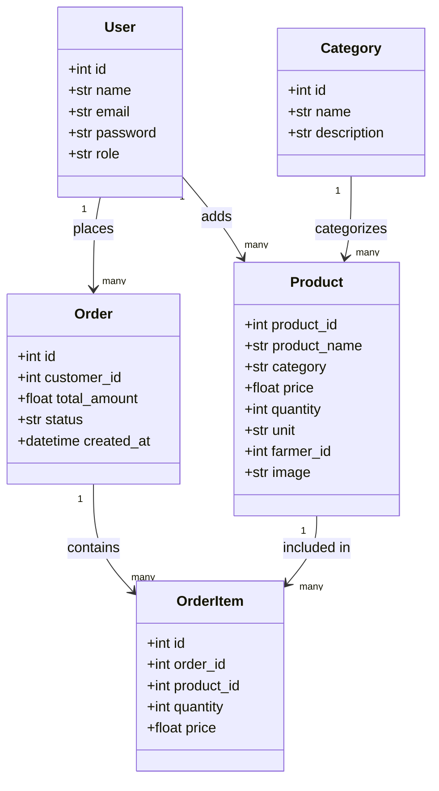

# Class Diagram - Local Farmers Produce Direct-Selling Marketplace

```mermaid
classDiagram

    class User {
        +int id
        +str name
        +str email
        +str password
        +str role
    }

    class Product {
        +int product_id
        +str product_name
        +str category
        +float price
        +int quantity
        +str unit
        +int farmer_id
        +str image
    }

    class Order {
        +int id
        +int customer_id
        +float total_amount
        +str status
        +datetime created_at
    }

    class OrderItem {
        +int id
        +int order_id
        +int product_id
        +int quantity
        +float price
    }

    class Category {
        +int id
        +str name
        +str description
    }

    User "1" --> "many" Product : adds
    User "1" --> "many" Order : places
    Order "1" --> "many" OrderItem : contains
    Product "1" --> "many" OrderItem : included in
    Category "1" --> "many" Product : categorizes
```