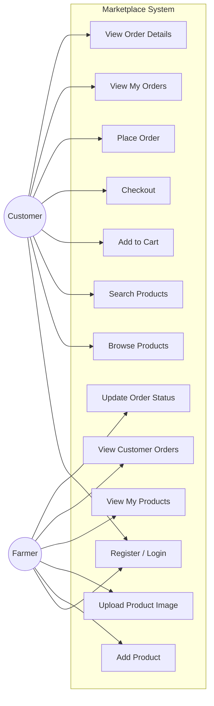

# UML Use Case Diagram - Local Farmers Produce Direct-Selling Marketplace

```mermaid
flowchart LR

    Customer((Customer))
    Farmer((Farmer))

    subgraph Marketplace System
        A[Register / Login]
        B[Browse Products]
        C[Search Products]
        D[Add to Cart]
        E[Checkout]
        F[Place Order]
        G[View My Orders]
        H[View Order Details]

        I[Add Product]
        J[Upload Product Image]
        K[View My Products]
        L[View Customer Orders]
        M[Update Order Status]
    end

    Customer --> A
    Customer --> B
    Customer --> C
    Customer --> D
    Customer --> E
    Customer --> F
    Customer --> G
    Customer --> H

    Farmer --> A
    Farmer --> I
    Farmer --> J
    Farmer --> K
    Farmer --> L
    Farmer --> M
```